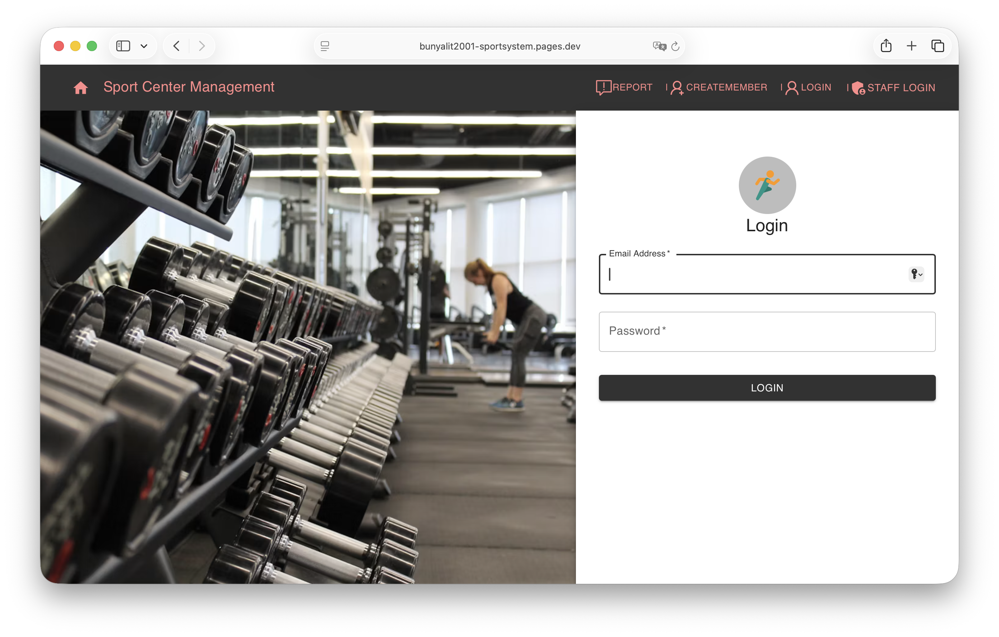
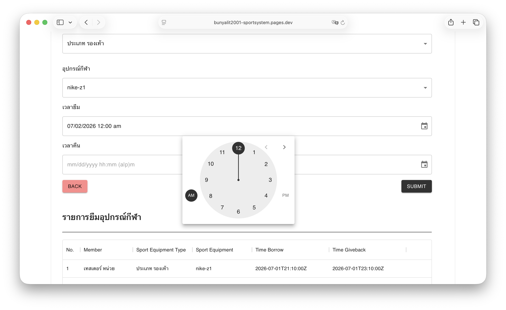

# Sport Center Management System

เว็บแอพสำหรับจัดการระบบศูนย์กีฬา ประกอบด้วยระบบสมาชิก ระบบเจ้าหน้าที่ การจองสนาม การยืมอุปกรณ์กีฬา การชำระเงิน การแจ้งปัญหา และการเช็คอิน/เช็คเอาท์การใช้งานสนาม

โปรเจกต์นี้พัฒนาขึ้นเป็นส่วนหนึ่งของรายวิชา SA (System Analysis) และถูกจัดเรียบเรียงเป็น repository สำหรับแสดงผลงานบน GitHub

## ✨ Features (ระบบที่รองรับ)
- 👥 **ระบบสมาชิกและเจ้าหน้าที่:** สมัครสมาชิก เข้าสู่ระบบ และจัดการสิทธิ์การเข้าถึง (Role-based)
- 🏟️ **การจองสนาม:** ค้นหาและทำรายการจองล่วงหน้า
- 🏀 **การยืม-คืนอุปกรณ์กีฬา:** จัดการสต๊อกและการยืม
- 💳 **ระบบชำระเงิน:** จัดการบิลและค่าบริการ
- 🛠️ **ระบบแจ้งปัญหา:** สำหรับรายงานอุปกรณ์หรือสถานที่ชำรุด
- ✅ **เช็คอิน/เช็คเอาท์:** บันทึกเวลาเข้าใช้งานสนามจริง



## Tech Stack

- Backend: Go, Gin, GORM
- Frontend: React, TypeScript, Material UI
- Database: Neon PostgreSQL

## โครงสร้างโปรเจกต์

```text
sport-center-management-system/
├── backend/   # REST API, database schema, seed data
└── frontend/  # React web application
```

## สิ่งที่ต้องติดตั้งก่อนรัน

- Go 1.19 หรือใหม่กว่า
- Node.js และ npm

## วิธี clone และรันทดสอบ

```bash
git clone https://github.com/bunyalit2001/SportSystem
cd SportSystem
```

### 1. ลบฐานข้อมูลเดิม

ถ้ารันแบบ SQLite local ให้ลบไฟล์ SQLite เดิมก่อนรัน backend เพื่อให้ระบบสร้างฐานข้อมูลและ seed data ใหม่

```bash
rm -f backend/sport-center-management.db
```

### 2. รัน Backend

```bash
cd backend
go mod tidy
go run main.go
```

Backend จะรันที่

```text
http://localhost:8080
```

Health check:

```text
GET /healthz  # ตรวจว่า backend ทำงานได้
GET /readyz   # ตรวจว่า backend ติดต่อ database ได้
```

### 3. รัน Frontend

เปิด terminal อีกหน้าต่าง แล้วรันคำสั่ง

```bash
cd frontend
npm install
npm start
```

Frontend จะรันที่:

```text
http://localhost:3000
```

## บัญชีเจ้าหน้าที่สำหรับทดสอบ

ระบบมี seed data สำหรับบัญชีเจ้าหน้าที่ และมี flow การทดสอบแยกไว้ใน [FLOW.md](./FLOW.md)

ระบบ login จะคืนค่า `role` เป็น `member` หรือ `staff` และ frontend/backend ใช้ role นี้เพื่อจำกัดการเข้าถึงหน้าหรือ API ที่เกี่ยวข้อง

## การใช้งานเบื้องต้น



1. เข้าเว็บที่ `http://localhost:3000`
2. สมัครสมาชิกที่หน้า Create Member หรือเข้าสู่ระบบสมาชิกที่หน้า Login
3. เข้าสู่ระบบเจ้าหน้าที่ได้ที่หน้า Staff Login
4. ใช้งานเมนูหลัก เช่น จองสนาม ยืมอุปกรณ์ ชำระเงิน แจ้งปัญหา และเช็คอิน/เช็คเอาท์

ดูรายละเอียด path, role, demo account และลำดับการทดสอบได้ที่ [FLOW.md](./FLOW.md)

## หมายเหตุ

- Frontend เรียก API จาก `REACT_APP_API_URL` หรือ fallback ไปที่ `http://localhost:8080`
- Backend จะใช้ `DATABASE_URL` ถ้าไม่มีทั้งคู่จะ fallback เป็น SQLite local
- หากรัน SQLite จาก path อื่น ฐานข้อมูล SQLite อาจถูกสร้างผิดตำแหน่ง ควรรันคำสั่งจากโฟลเดอร์ `backend`
- สำหรับ Fly.io สามารถ setup ภายหลังได้ โดย backend ต้องตั้ง `DATABASE_URL` เป็น secret และ frontend ต้องตั้ง `REACT_APP_API_URL` ให้ชี้ไปยัง backend ที่ deploy แล้ว
